<div align="center">

# 🛒 MCV Store

### ASP.NET Core MVC E-Commerce Application

[](https://dotnet.microsoft.com/)
[](https://learn.microsoft.com/en-us/ef/core/)
[](https://www.microsoft.com/en-us/sql-server)
[](https://getbootstrap.com/)
[](LICENSE)

A full-featured e-commerce web application built with **ASP.NET Core MVC (.NET 10)**, **Entity Framework Core**, and **SQL Server**.  
Developed as an ITI training project demonstrating clean architecture, identity management, and real-world shopping workflows.

---

</div>

## 📋 Table of Contents

- [✨ Features](#-features)
- [🛠️ Tech Stack](#️-tech-stack)
- [📁 Project Structure](#-project-structure)
- [🗄️ Database Schema](#️-database-schema)
- [🚀 Getting Started](#-getting-started)
- [🏗️ Architecture](#️-architecture)
- [📸 Screenshots](#-screenshots)
- [📄 License](#-license)

---

## ✨ Features

### 🛍️ Customer-Facing

| Feature | Description |
|:--------|:------------|
| 📦 **Product Catalog** | Browse, search, filter by category, sort, and paginate products |
| 🔍 **Product Details** | View product info with stock availability |
| 🛒 **Shopping Cart** | Add/update/remove items with real-time stock validation |
| 💳 **Checkout** | Select a shipping address and place orders |
| 📜 **Order History** | View past orders with status tracking and details |
| 📍 **Address Management** | CRUD operations for shipping addresses with default address support |

### 🔧 Admin Panel

| Feature | Description |
|:--------|:------------|
| 📊 **Dashboard** | Central hub for all admin operations |
| 📦 **Manage Products** | Create, edit, delete, and toggle active/inactive products |
| 🏷️ **Manage Categories** | Hierarchical categories with parent-child relationships |
| 📋 **Manage Orders** | View all orders and update order status (Pending → Processing → Shipped → Delivered / Cancelled) |
| 👥 **Manage Users** | View users and assign/remove roles |

### 🔐 Authentication & Authorization

| Feature | Description |
|:--------|:------------|
| 🪪 **ASP.NET Identity** | Registration, login, logout with password policies |
| 🛡️ **Role-Based Access** | Admin, SubAdmin, and Customer roles |
| 🔒 **`[Authorize]`** | Protected controllers for cart, orders, and admin areas |

---

## 🛠️ Tech Stack

<div align="center">

| Layer | Technology | Badge |
|:------|:-----------|:------|
| **Framework** | ASP.NET Core MVC (.NET 10) |  |
| **ORM** | Entity Framework Core 10 |  |
| **Database** | SQL Server |  |
| **Authentication** | ASP.NET Core Identity |  |
| **Frontend** | Razor Views, Bootstrap 5 |  |
| **Architecture** | Repository + Unit of Work |  |

</div>

---

## 📁 Project Structure

```
📦 ITI-MVC-Project/
├── 📂 Entities/                          # 🗃️ Data layer
│   ├── 📂 Data/
│   │   └── 📄 AppDbContext.cs            # EF Core context, relationships, query filters, soft delete
│   ├── 📂 Models/
│   │   ├── 📄 Base.cs                    # BaseEntity (Id, IsDeleted, CreatedAt, UpdatedAt)
│   │   ├── 📄 User.cs                    # IdentityUser extension
│   │   ├── 📄 Product.cs
│   │   ├── 📄 Category.cs                # Self-referencing parent/child
│   │   ├── 📄 Order.cs                   # OrderStatus enum
│   │   ├── 📄 OrderItem.cs
│   │   ├── 📄 Cart.cs                    # One-to-one with User
│   │   ├── 📄 CartItem.cs                # Unique (CartId, ProductId) filtered index
│   │   └── 📄 Address.cs                 # IsDefault flag
│   ├── 📂 Repositories/
│   │   ├── 📄 EntityRepo.cs              # Generic repo with Query(), GetAll(), FindAll()
│   │   └── 📄 UnitOfWork.cs              # Aggregates all repos + SaveChanges()
│   └── 📂 Migrations/
│
├── 📂 MCV/                               # 🌐 Web layer
│   ├── 📂 Controllers/
│   │   ├── 📄 HomeController.cs
│   │   ├── 📄 AccountController.cs       # Login, Register, Logout, Address CRUD
│   │   ├── 📂 Customer/
│   │   │   ├── 📄 CatalogController.cs   # Index (filter/sort/page), Details
│   │   │   ├── 📄 CartController.cs      # Add, UpdateQuantity, Remove, Clear
│   │   │   └── 📄 OrderController.cs     # Checkout, PlaceOrder, Details, Index
│   │   └── 📂 Admin/
│   │       ├── 📄 AdminController.cs     # Dashboard
│   │       ├── 📄 ManagerController.cs   # User role management
│   │       ├── 📄 ManageCategoryController.cs
│   │       ├── 📄 ManageProductsController.cs
│   │       └── 📄 ManageOrdersController.cs
│   ├── 📂 ViewModels/                    # View-specific data models
│   ├── 📂 Views/                         # Razor views organized by controller
│   └── 📄 Program.cs                     # DI, middleware, Identity config
```

---

## 🗄️ Database Schema

```
👤 User (IdentityUser)
 ├── 1:N → 📍 Address (IsDefault)
 ├── 1:N → 📋 Order
 └── 1:1 → 🛒 Cart
                └── 1:N → 📦 CartItem → Product

🏷️ Category (self-ref ParentCategory)
 └── 1:N → 📦 Product
                └── 1:N → 📋 OrderItem → Order
```

### 🔑 Key Design Decisions

> | Decision | Details |
> |:---------|:--------|
> | 🗑️ **Soft Delete** | All entities inherit `BaseEntity.IsDeleted`; `SaveChanges()` intercepts deletes and sets the flag. **Exception:** Cart/CartItem use hard delete (transient data). |
> | 🔍 **Global Query Filters** | `HasQueryFilter(e => !e.IsDeleted)` on all entities automatically excludes deleted rows. |
> | 🔗 **Filtered Unique Index** | `CartItem(CartId, ProductId)` is unique only where `IsDeleted = 0`, preventing conflicts with soft-deleted rows. |
> | 🕐 **Audit Fields** | `CreatedAt` set on insert, `UpdatedAt` set on modify, all handled in `ApplyAuditAndSoftDelete()`. |

---

## 🚀 Getting Started

### 📋 Prerequisites

| Requirement | Link |
|:------------|:-----|
|  | [Download .NET 10](https://dotnet.microsoft.com/download) |
|  | [Download SQL Server](https://www.microsoft.com/en-us/sql-server/sql-server-downloads) (LocalDB or full instance) |

### ⚙️ Setup

**1️⃣ Clone the repository**
```bash
git clone https://github.com/Bish0y-Adel/ITI_MVC_Project.git
cd ITI_MVC_Project
```

**2️⃣ Configure the connection string**

Update `appsettings.json` in the `MCV` project:
```json
{
  "ConnectionStrings": {
    "Connection1": "Server=.;Database=MCVStoreDb;Trusted_Connection=True;TrustServerCertificate=True;"
  }
}
```

**3️⃣ Apply migrations**
```bash
dotnet ef database update --project Entities --startup-project MCV
```

**4️⃣ Run the application**
```bash
dotnet run --project MCV
```

**5️⃣ Access the app**
- 🌐 Home: `https://localhost:5001`
- 👤 Register a new account, then use the Admin dashboard to assign roles.

### 👥 Default Roles (Seeded)

| Role | Badge | Purpose |
|:-----|:------|:--------|
| **Admin** |  | Full access to all admin features |
| **SubAdmin** |  | Limited admin access |
| **Customer** |  | Default role for registered users |

---

## 🏗️ Architecture

### 🔄 Repository + Unit of Work

```
🎮 Controller  →  📦 UnitOfWork  →  🗃️ EntityRepo<T>  →  💾 AppDbContext  →  🗄️ SQL Server
```

| Component | Description |
|:----------|:------------|
| 🗃️ **`EntityRepo<T>`** | Generic repository with `Query()` (returns `IQueryable` for deferred execution), `GetAll()`, `FindAll()`, `GetById()`, `Add()`, `Update()`, `Delete()` |
| 📦 **`UnitOfWork`** | Groups all repos; single `SaveChanges()` call commits all changes atomically |
| 🔍 **`Query()` method** | Returns `IQueryable<T>` for server-side filtering, sorting, and pagination (avoids loading entire tables into memory) |

### 🛒 Order Flow

```
📦 Catalog  →  ➕ Add to Cart  →  🛒 Cart  →  💳 Checkout (select address)  →  ✅ PlaceOrder  →  📋 Order Details
                                                        │
                                                        ├── ✔️ Validates stock per item
                                                        ├── 📝 Creates Order + OrderItems
                                                        ├── 📉 Decrements Product.StockQuantity
                                                        └── 🗑️ Clears cart (hard delete)
```

---

## 📸 Screenshots

### 🛍️ Customer Experience

<details>
<summary><b>📦 Product Catalog</b></summary>
<br>

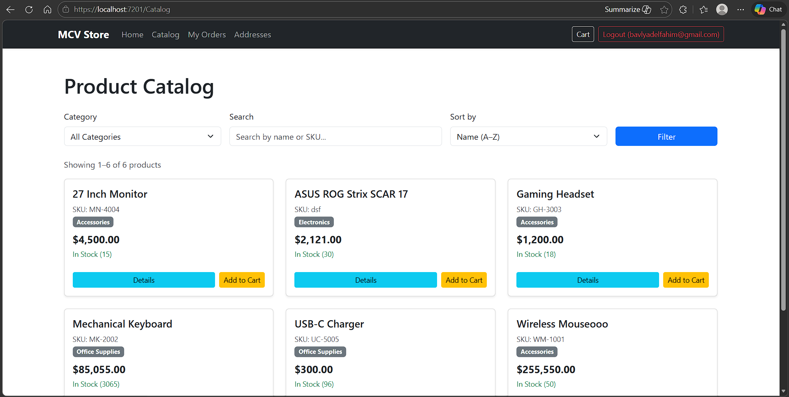

</details>

<details>
<summary><b>🔍 Product Details</b></summary>
<br>

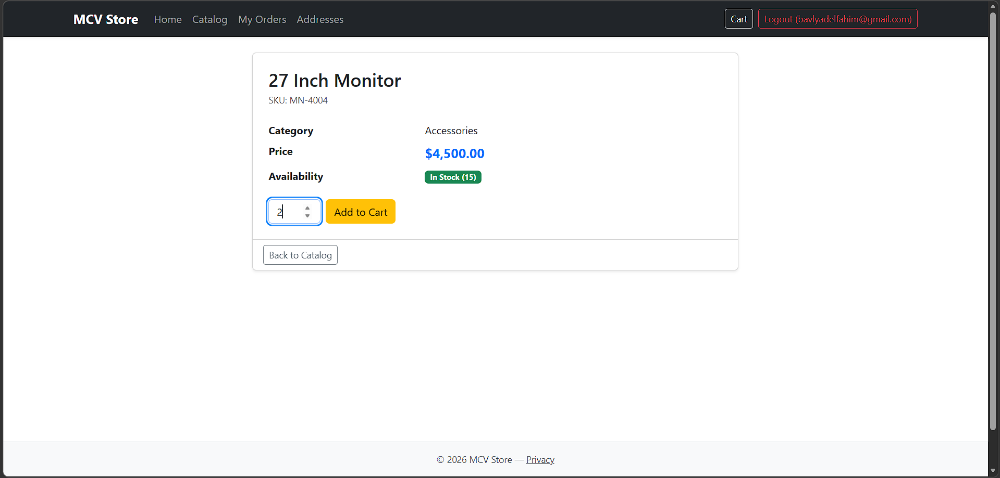

</details>

<details>
<summary><b>🛒 Shopping Cart</b></summary>
<br>

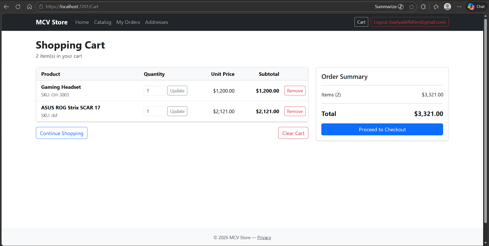

</details>

<details>
<summary><b>📋 Orders</b></summary>
<br>

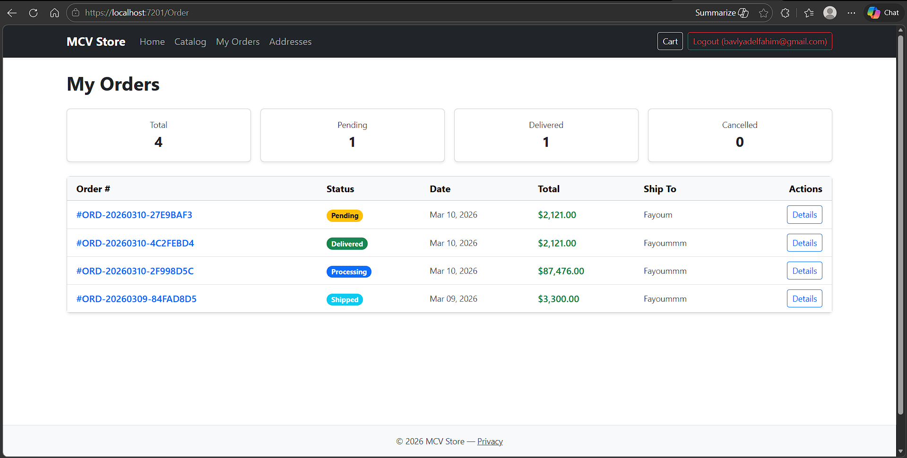

</details>

<details>
<summary><b>📄 Order Details</b></summary>
<br>

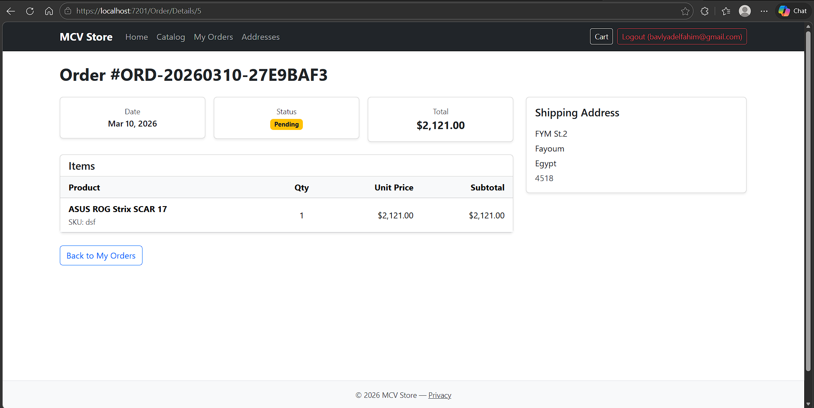

</details>

<details>
<summary><b>📍 Addresses</b></summary>
<br>

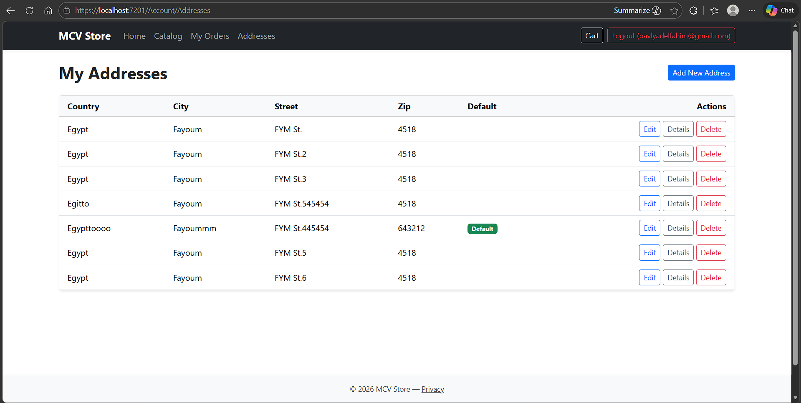

</details>

---

### 🔧 Admin Panel

<details>
<summary><b>📦 Product Management</b></summary>
<br>

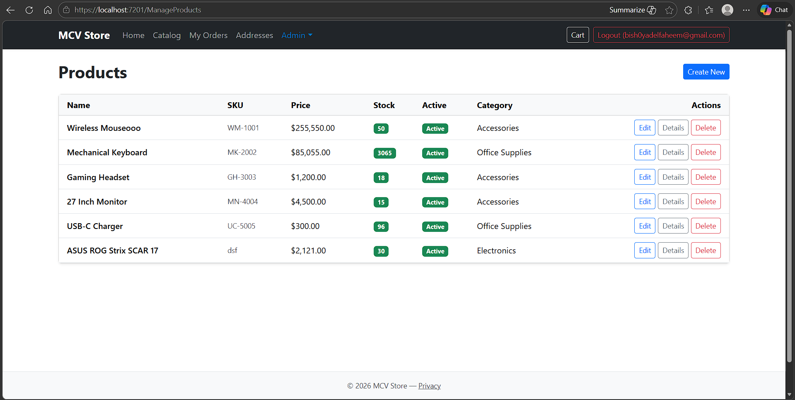

</details>

<details>
<summary><b>➕ Create Product</b></summary>
<br>

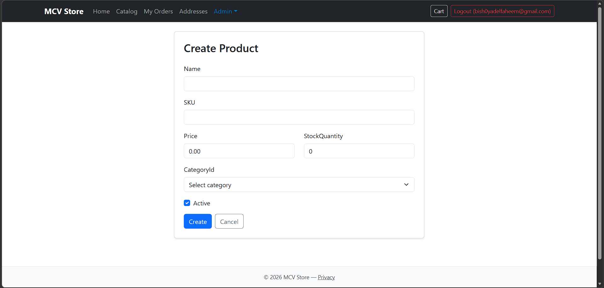

</details>

<details>
<summary><b>🏷️ Categories</b></summary>
<br>

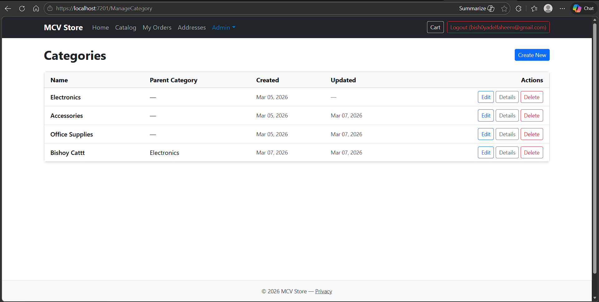

</details>

<details>
<summary><b>✏️ Edit Category</b></summary>
<br>

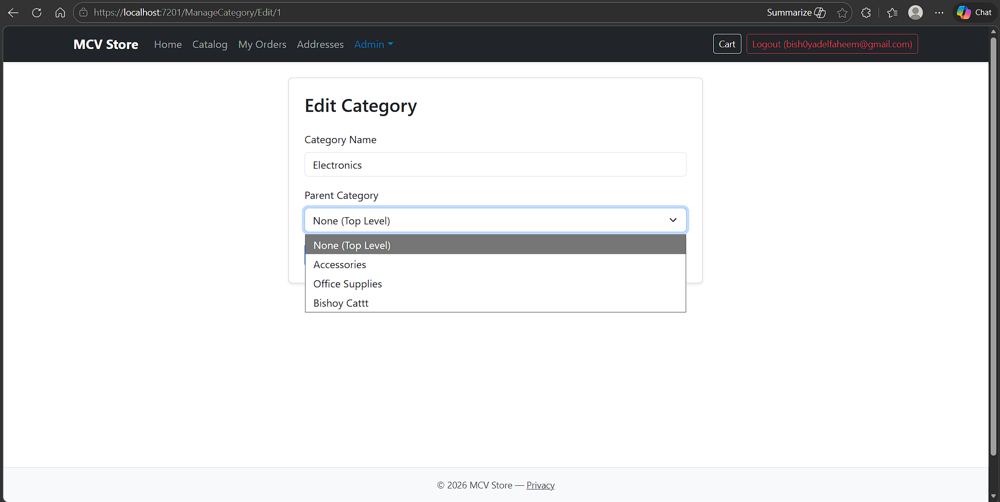

</details>

<details>
<summary><b>📋 Manage Orders</b></summary>
<br>

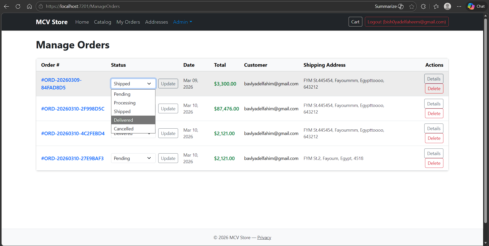

</details>

<details>
<summary><b>👥 User Management</b></summary>
<br>

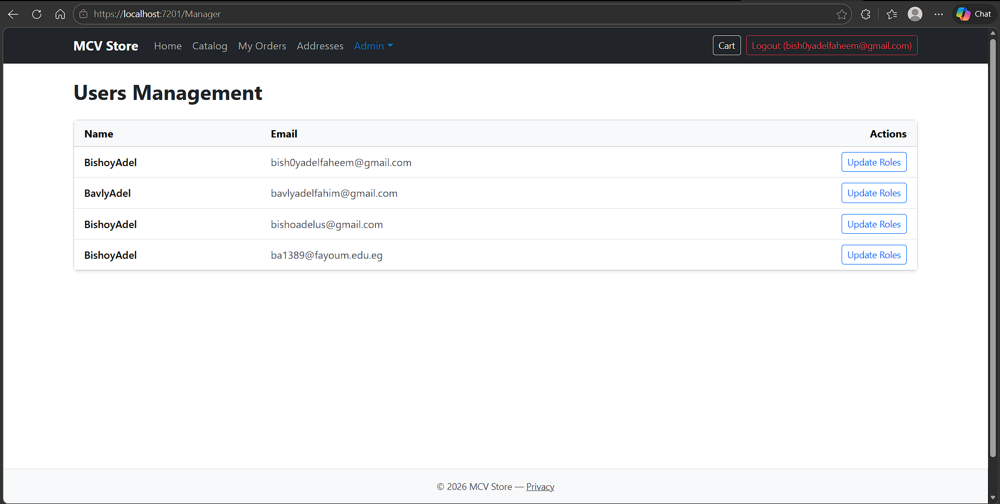

</details>

---

## 📄 License

This project was developed as part of the **ITI (Information Technology Institute)** training program.

---

<div align="center">

**⭐ If you found this project helpful, give it a star!**

Made with ❤️ for ITI

</div>
